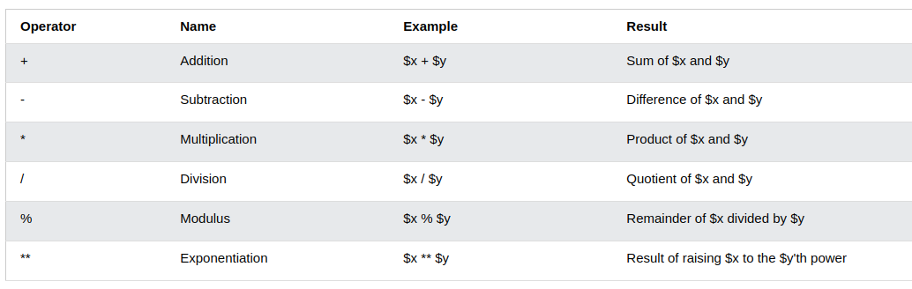
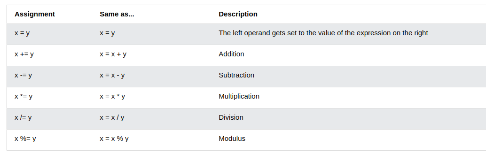
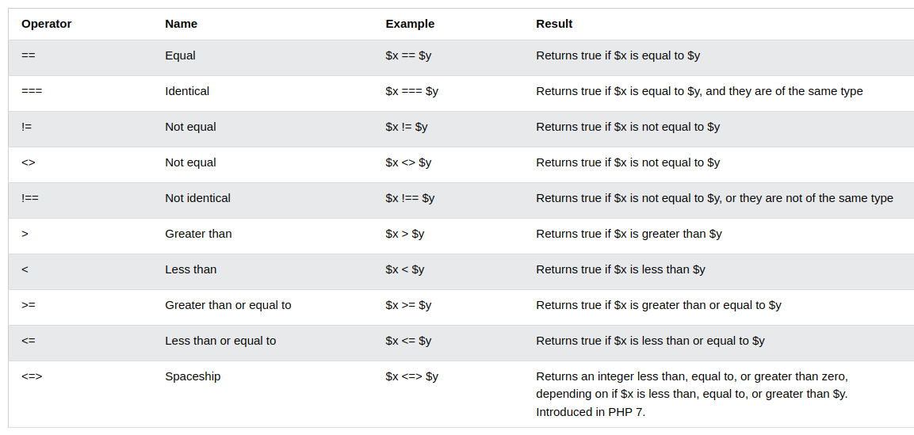
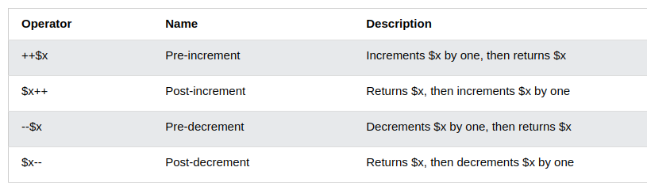
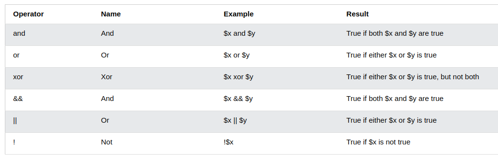

# PHP-Basic
## Introduction to web Technology (Công nghệ Web)
 * **Khái niệm:**  Công nghệ web là một thuật ngữ chung đề cập đến nhiều ngôn ngữ và gói đa phương tiện được sử dụng kết hợp với nhau, để tạo ra các trang web. Mỗi công nghệ có chức năng riêng biệt và cần yêu cầu sử dụng kép ít nhất thêm một công nghệ khác.
## Introduction to HTML5 and CSS     
### HTML5
* **Khái niệm:** HTML5 là phiên bản mới (chuẩn mới) của HTML (Hypertext Markup Language) để trình bày trang web.
* Trang HTML5 mặc định giải mã ký tự theo UTF-8
* **Một số cải tiến:** 
  * Các phần tử mới: `<footer>`,`<header>`, ... 
  * Cải tiến Form: hỗ trợ kiểu input mới, các phương thức put và dalete. Tạo các Form mạnh mẽ hơn. 
  * Có các yếu tố đồ họa mới bao gồm đồ họa vector và tags.
  * Cho phép vẽ nhiều hình dạng khác nhau như hình tam giác, hình chữ nhật, hình tròn, v.v.
  * ...
* **Thuận lợi:**
  * Hỗ trợ nhiều trình duyệt hơn.
  * Thân thiện với nhiều thiết bị.
  * Dễ sử dụng và thực hiện hơn.
  * Tích hợp với CSS và JS, v.v. có thể xây dựng các trang web tốt hơn.
### CSS
* **Khái niệm:** CSS là một ngôn ngữ chuyên dùng để trình bày hình thức thể hiện của văn bản HTML cho người dùng, như văn bản đó được định dạng ra sao (cơ chữ, font chữ, màu sắc ...), bố cục, dàn trang thế nào ...

  * CSS viết tắt của cụm từ Cascading Style Sheets, về ngữ nghĩa thì có thể hiểu: Cascading là cách làm việc của CSS, các CSS tác dụng vào phần tử HTML có thể bị đè (định nghĩa lại) bởi CSS khác hoặc kết hợp cùng với CSS khác
* **Tại sao cần dùng CSS:** 
  * Tiết kiệm thời gian: Có thể viết 1 lần và dùng cho nhiều trang.
  * Bảo trì dễ dàng: Chỉ cần thay đổi nội dung trong file css và tất cả các trang sẽ được cập nhật.
  * Được coi là 1 kỹ thuật mã hóa sạch.
  * Có thể xem trên trang ngoại tuyến.
## Introduction PHP
 * **Khái niệm:** Thuật ngữ PHP là từ viết tắt của PHP: Hypertext Preprocessor. PHP là một ngôn ngữ kịch bản phía máy chủ được thiết kế đặc biệt để phát triển web.
   * Là mã nguồn mở nên dễ dàng để tải xuống và sử dụng miễn phí. Tệp có phần mở rộng là ".php".
   * Là ngôn ngữ thông dịch và thực thi phía máy chủ.
   * Có thể tích hợp với nhiều CSDL.
   * Hỗ trợ các giao thức chính như HTTP Basic.
   * HTML, CSS và JS có thể được nhúng dễ dàng vào file PHP.
 * **Các đặc điểm:** 
   * Đơn giản, nhanh chóng, hiệu quả, linh hoạt.
   * Đa nền tảng, có thể hoạt động trên Linux, Win, MacOS.
   * Mã nguồn mở.
   * Thư viện hỗ trợ mạnh mẽ.
   * Kết nối CSDL.
 * **PHP 7:**
   * Nhanh hơn nhiều so với bản phát hành ổn định 5.6.
   * Cải thiện xử lý lỗi.
   * Hỗ trợ khai báo kiểu chặt chẽ hơn cho các đối số hàm.
 ## PHP 
 ### **Basic PHP Syntax**
* Tập lệnh PHP có thể đặt ở bất kỳ đâu trong tài liệu. 
* Nó bắt đầu và kết thúc bằng cặp `<?php ?>`. Các câu lệnh PHP kết thúc bằng dấu " ; "
* Phần mở rộng cho tệp mặc định là ".php"
```php
<?php
    echo "Hello World !";
?> 
```

* Trong PHP, các từ khóa, các lớp, hàm và các hàm do người dùng tự định nghĩa không phân biệt chữ hoa và chữ thường.
* Tất cả các biến đều phân biệt chữ hoa và chữ thường.

### **PHP Data Types**
#### String
* String là một chuỗi các ký tự, có thể là bất kỳ văn bản nào bên trong dấu nháy kép hoặc nháy đơn.
```php
<?php
    $string = "String";
    echo $string;
    // biến string có kiểu dữ liệu là string với giá trị là "String"
?>
```
#### Integer
* Kiểu số nguyên là một số không thập phân có dải giá trị từ -2,147,483,648 đến 2,147,483,647.
* Một số quy tắc với kiểu số nguyên: 
  * Có ít nhất 1 số.
  * Không được có dấu thập phân. 
  * Có thể là số dương hoặc số âm.
```php
<?php
    $int = 1234;
    // biến int được khai báo kiểu dữ liệu số nguyên với giá trị là 1234
?>
```
#### Float 
* Số dấu phẩy động là một số có dấu thập phân hoặc một số ở dạng hàm mũ.
```php
<?php
    $float_1 = 1.234;
    $float_2 = 1/2;
    // biến float_1 và float_2 được khai báo kiểu dữ liệu float
?>
```
#### Boolean
* Kiểu dữ liệu Boolean đại diện cho 2 trạng thái TRUE hoặc FALSE.
```php
<?php
    // có thể khai báo kiểu Boolean như sau 
    $x = true;
    $y = false;
?>
```
#### Array 
* Mảng có thể lưu trữ nhiều giá trị trong 1 biến duy nhất. 
```php
<?php
    $arr = array("Pham", "Huy", "Hung");
    // biến arr có kiểu dữ liệu dạng mảng với 3 giá trị
?>
```
#### Object 
* Class và Object là khía cạnh thuộc về lập trình hướng đối tượng. 
* Class là khuôn mẫu cho các Object và một Object là thể hiện của một Class. 
* Các Object kế thừa tất cả thuộc tính và hành vi của Class nhưng mang những giá trị khác nhau. 
```php
<?php
    // khai báo class Person
    class Person{
        // khai báo 2 thuộc tính của class là name và age
        public $name;
        public $age;

        // khai báo hàm khởi tạo của class
        public function __construct($name, $age)
        {
            $this->name = $name;
            $this->age = $age;
        }

        // khai báo phương thức cho class
        public  function getInfo(){
            return $this->name." ".$this->age;
        }
    }

    // khởi tạo object person_1 
    $person_1 = new Person("Hung", 22);
    echo $person_1->getInfo();
?>
```
### PHP Variables, Constants and Array 
#### PHP Variables (Biến)
* Trong PHP, 1 biến bắt đầu bằng dấu `$`, theo sau là tên của biến.
* Quy tắc cho các biến trong PHP: 
  * Một biến bắt đầu bằng dấu `$`, theo sau là tên của biến.
  * Tên biến phải bắt đầu bằng một chữ cái hoặc ký tự gạch dưới.
  * Tên biến không thể bắt đầu bằng số.
  * Tên biến chỉ có thể chứa các ký tự chữ-số và dấu gạch dưới (Az, 0-9 và _).
  * Tên biến có phân biệt chữ hoa chữ thường.
#### PHP Constants (Hằng)
* Hằng số là một định danh cho 1 simple value và không thể thay đổi giá trị trong tập lệnh
và là toàn cục.
* Tên hằng hợp lệ bắt đầu bằng 1 chữ cái hoặc dấu gạch dưới (không có `$`).
* Để tạo hằng số, sử dụng hàm `define()` với cú pháp : 
```php
    define(name, value, case-insensitive);
    // trong đó name là tên hằng, value là giá trị hằng và case-insensitive để chỉ định phân biệt 
    // chữ hoa và chữ thường. Mặc định là có (FALSE).
    // có thể sử dụng để tạo hẳng mảng như sau: 
    define(arr, [1, 2, 3]);
```
#### PHP Array (Mảng)
***Mảng***
* Mảng là một biến đặc biệt, có thể chứa nhiều giá trị cùng 1 lúc.
* `array()` được dùng để tạo 1 mảng trong PHP.
```php
<?php
    $arr = array("Pham", "Huy", "Hung");
?>
```
* Có ba loại mảng: 
  * Mảng chỉ mục - Mảng được lập chỉ mục số. 
  * Mảng liên kết - Mảng có các khóa được đặt tên.
  * Mảng nhiều chiều - Mảng chứa 1 hoặc nhiều mảng.

***Mảng được lập chỉ mục***
* Có 2 cách để tạo mảng được lập chỉ mục: 
  * Chỉ mục có thể được chỉ định tự động (luôn bắt đầu từ 0).
  * Hoặc chỉ định thủ công: 
```php
<?php
    $arr = [];
    $arr[0] = 1;
    $arr[1] = 2;        
?>
```
***Mảng liên kết***
* Mảng liên kết là mảng sử dụng các khóa do người dùng đặt tên cho chúng.
* Có 2 cách tạo tương tự như mảng được lập chỉ mục: 
```php
<?php
    // cách 1
    $arr = array("name" => "Pham Hung", "age" => 22);
    
    // cách 2
    $arr = [];
    $arr[name] = "Pham Hung";
    $arr[age] = 22;
?>
```
***Mảng đa chiều***
* Mảng đa chiều là mảng mà bên trong đó chứa 1 hay nhiều mảng khác.
* Ví dụ ta có 1 mảng 2 chiều như sau: 
```php
<?php
    $person = array(
        array("Pham Hung", 22),
        array("Nguyen A", 19),
        array("Tran B", 23),
    );
    // để truy cập ta dùng $person[][]
?>
```
### PHP Operators (Toán tử)
* Toán tử được sử dụng để thực hiện các hoạt động dựa trên các biến và giá trị. 
* Toán tử trong PHP được chia thành các nhóm : 
  * Toán tử số học: 
  
  * Toán tử chuyển nhượng: 
  
  * Toán tử so sánh: 
  
  * Toán tử tăng giảm: 
  
  * Toán tử logic: 
  
  * Toán tử chuỗi. 
  * Toán tử mảng.
  * Toán tử chuyển nhượng.
### Control Structures 
#### if-else statement
 